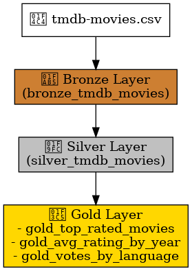
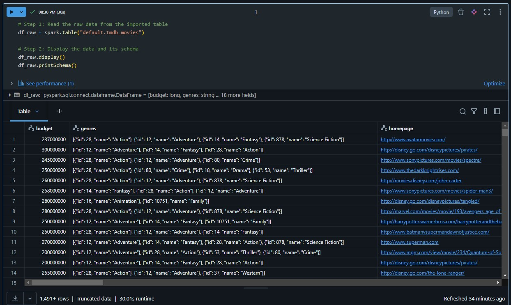
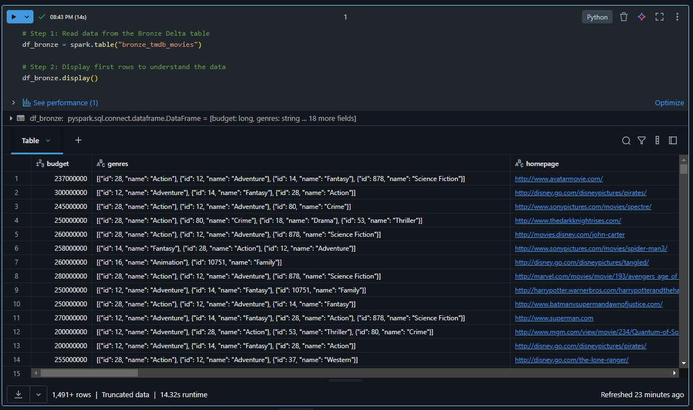
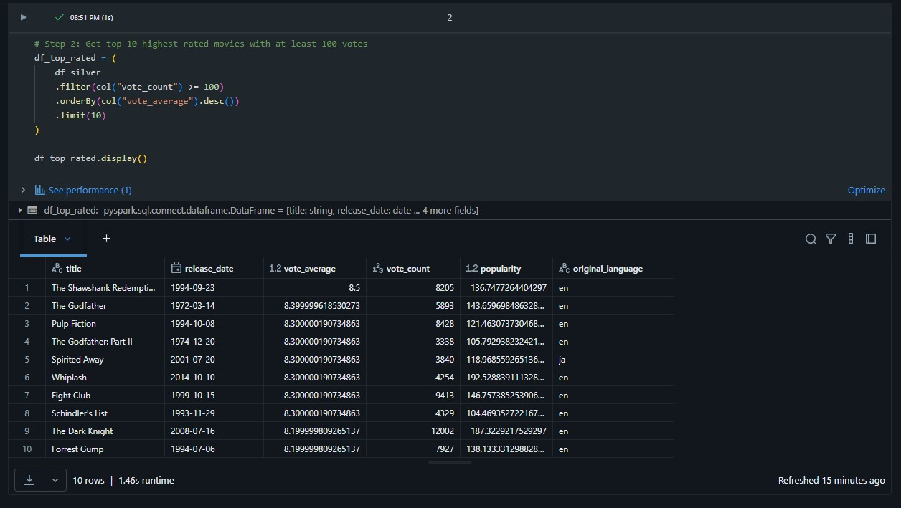
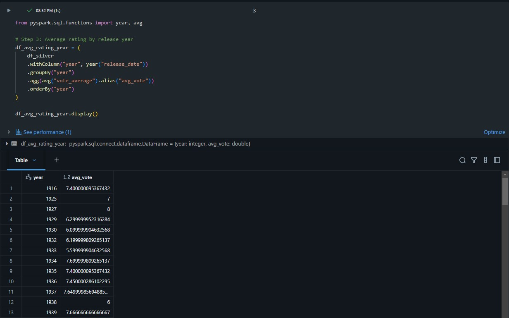
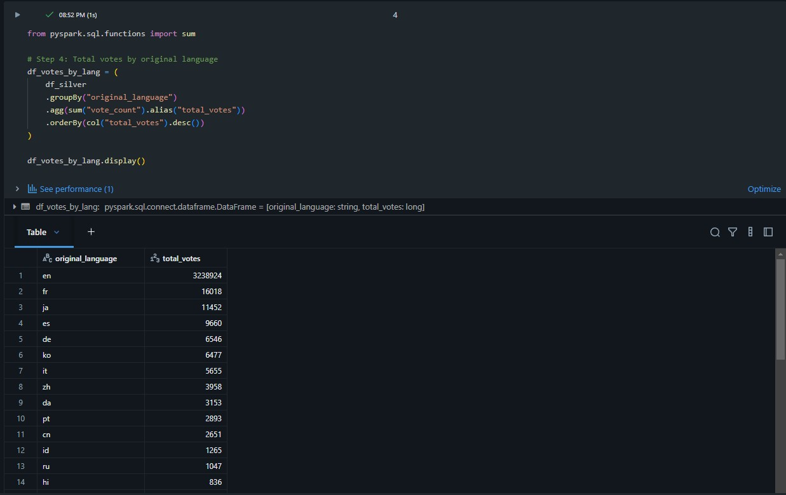
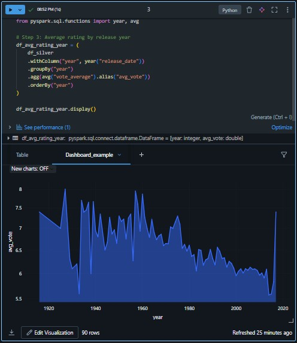

# 🎬 Databricks Movie Pipeline

This project demonstrates a complete **Data Engineering pipeline using Databricks and Delta Lake**, following the Medallion Architecture (Bronze, Silver, Gold).

## 💡 Project Overview

- **Source**: TMDB Movies Dataset (CSV)
- **Platform**: Databricks Community Edition
- **Technologies**: Apache Spark, Delta Lake, PySpark
- **Architecture**: Medallion (Bronze, Silver, Gold)

## 🧱 Pipeline Structure

1. **Bronze**: Raw ingestion from CSV into Delta table
2. **Silver**: Data cleaning and type transformation
3. **Gold**: Aggregated analytics for reporting

## 📊 Example Queries (Gold)
See [`docs/sample_queries.md`](docs/sample_queries.md) for sample SQL queries over the Gold and Silver tables.

- Top 10 highest-rated movies
- Average vote per year
- Total votes per language

## 🖼️ Architecture Diagram

## 🧪 Screenshots

  
  
  
  
  

## 🚀 How to Run

> This project was built entirely in [Databricks Community Edition](https://community.cloud.databricks.com)

1. Clone this repository
2. Import notebooks into Databricks
3. Upload `tmdb-movies.csv` using "Add Data"
4. Attach a cluster and run step by step

## 📊 Dashboard Example

Below is a sample visualization built using the Databricks built-in dashboard tool, based on the Gold layer data.

This chart shows the **average movie rating per year**, using cleaned and transformed data from the Silver table.

## 📂 Folder Structure

| Folder | Description |
|--------|-------------|
| `notebooks/` | Databricks notebooks (Bronze, Silver, Gold) |
| `datasets/` | Source CSV file |
| `docs/` | Diagram and notes |
| `images/` | Screenshots and visual assets |

